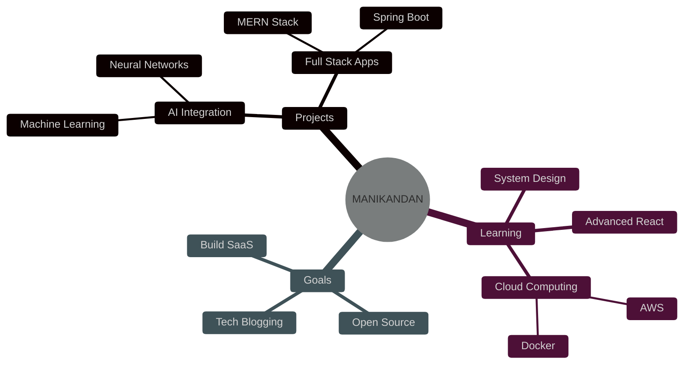

<div align="center">

<!-- ANIMATED BANNER -->


<!-- ANIMATED TYPING WITH CUSTOM STYLING -->
<h1>
  
</h1>

<!-- ANIMATED PROFILE BADGES -->
<p>
  
  
  
</p>

<p>
  
  
  
</p>

<!-- GLOWING NEON DIVIDER -->


</div>

<!-- ABOUT ME SECTION WITH COOL CARD DESIGN -->
<div align="center">

## 🎯 ABOUT ME

<table border="0" align="center">
<tr border="0">
<td width="50%" align="left">

```javascript
const MANIKANDAN = {
  code: ["JavaScript", "TypeScript", "Python", "Java"],
  askMeAbout: ["web dev", "AI/ML", "tech", "coffee"],
  technologies: {
    frontEnd: {
      js: ["React", "Angular"],
      css: ["Tailwind", "Bootstrap", "Sass"]
    },
    backEnd: {
      js: ["Node", "Express"],
      java: ["Spring Boot"],
      python: ["Django", "Flask"]
    },
    databases: ["MongoDB", "MySQL", "PostgreSQL"],
    tools: ["Git", "Docker", "Postman", "VS Code"]
  },
  currentFocus: "Building AI-powered web applications",
  funFact: "I debug with console.log() 🤫"
};
```

</td>
<td width="50%" align="center">

### 🚀 Quick Facts

🔭 Working on **real-world problem solving**

🌱 Learning **Full-Stack & AI**

👯 Open to **collaborations**

🤝 Need help with **AI integration**

💬 Ask me about **React, Node, Python, Java**

📫 **manikandankrishna331@gmail.com**

⚡ **Coffee ☕ → Code 💻 → Repeat 🔄**

</td>
</tr>
</table>

</div>

<!-- ANIMATED SNAKE -->
<div align="center">
  
  
## 🐍 WATCH MY CONTRIBUTION SNAKE EAT MY COMMITS!

<picture>
  <source media="(prefers-color-scheme: dark)" srcset="https://raw.githubusercontent.com/MANIKANDAN-17K/MANIKANDAN-17K/output/github-contribution-grid-snake-dark.svg">
  <source media="(prefers-color-scheme: light)" srcset="https://raw.githubusercontent.com/MANIKANDAN-17K/MANIKANDAN-17K/output/github-contribution-grid-snake.svg">
  
</picture>


</div>

<!-- STATS SECTION WITH CUSTOM STYLING -->
<div align="center">

## 📊 GITHUB STATS - LIVE TRACKING!


<details>
<summary><b>📈 Click to Expand My Full Stats Dashboard</b></summary>

<br>

<!-- STATS CARDS -->
<p align="center">
  
  
</p>

<!-- DETAILED STATS -->
<p align="center">
  
  
</p>

<!-- ACTIVITY GRAPH -->


<!-- SUMMARY CARDS -->


</details>


</div>

<!-- TECH STACK WITH ANIMATED ICONS -->
<div align="center">

## 💻 TECH ARSENAL - MY WEAPONS OF CHOICE

### ⚡ Languages
<p>
  
  
  
  
  
  
</p>

### 🎨 Frontend Frameworks & Libraries
<p>
  
  
  
  
  
  
  
  
</p>

### ⚙️ Backend & Databases
<p>
  
  
  
  
  
  
  
  
  
</p>

### 🛠️ Tools & DevOps
<p>
  
  
  
  
  
  
  
  
  
</p>


</div>

<!-- CODING ACTIVITY -->
<div align="center">

## 📈 LANGUAGE PROFICIENCY - AUTO-UPDATING!


### 🔥 Real-Time Progress Tracking

<table>
<tr>
<td align="center" width="200">
<br>

<br>

</td>

<td align="center" width="200">
<br>

<br>

</td>

<td align="center" width="200">
<br>

<br>

</td>
</tr>

<tr>
<td align="center" width="200">
<br>

<br>

</td>

<td align="center" width="200">
<br>

<br>

</td>

<td align="center" width="200">
<br>

<br>

</td>
</tr>
</table>


</div>

<!-- CURRENT PROJECTS & GOALS -->
<div align="center">

## 🎯 CURRENT FOCUS & GOALS




</div>

<!-- GITHUB ACHIEVEMENTS -->
<div align="center">

## 🏆 ACHIEVEMENTS & TROPHIES


</div>

<!-- GITHUB METRICS -->
<div align="center">

## 📊 DETAILED METRICS & INSIGHTS


</div>

<!-- CONNECT WITH ME -->
<div align="center">

## 🌐 CONNECT WITH ME - LET'S BUILD TOGETHER!

<p>
<a href="https://github.com/MANIKANDAN-17K">
  
</a>
<a href="mailto:manikandankrishna331@gmail.com">
  
</a>
<a href="https://linkedin.com/in/YOUR_LINKEDIN">
  
</a>
<a href="https://twitter.com/YOUR_TWITTER">
  
</a>
<a href="https://instagram.com/YOUR_INSTAGRAM">
  
</a>
<a href="YOUR_PORTFOLIO">
  
</a>
<a href="YOUR_BLOG">
  
</a>
</p>


</div>

<!-- DEV QUOTE -->
<div align="center">

## 💭 THOUGHT OF THE DAY


</div>

<!-- RANDOM DEV MEME -->
<div align="center">

## 😄 DAILY DEV HUMOR


</div>

<!-- SPOTIFY PLAYING -->
<div align="center">

## 🎵 CURRENTLY VIBING TO

[](https://github.com/kittinan/spotify-github-profile)


</div>

<!-- FOOTER WAVE -->
<div align="center">

## 💼 OPEN TO OPPORTUNITIES

### 🎯 Looking for Full Stack Development Roles | AI/ML Projects | Open Source Contributions


### ⭐ Show some love by starring repositories you find interesting!

<h3>

</h3>

</div>
═════════════════════════════════════════════════════════════════════════
-->
